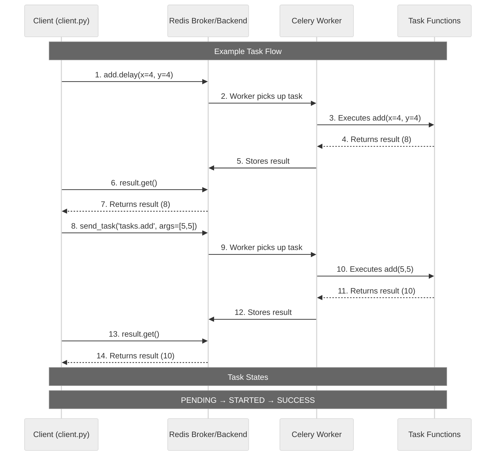

# Celery Tutorial

A simple Celery application with Redis as the message broker and result backend.

## Introduction to Celery

Celery is a distributed task queue system that allows you to run tasks asynchronously across multiple workers. It's particularly useful for handling time-consuming operations that shouldn't block your main application. Think of it as a way to delegate work to other processes or machines, allowing your main application to remain responsive.

### System Architecture

Here's a visual representation of how our Celery system works:



The diagram shows:
1. How tasks are sent using both `delay()` and `send_task()`
2. The flow of messages through Redis
3. How the worker processes tasks
4. How results are stored and retrieved
5. The complete lifecycle of a task

### Key Components

- **Message Broker (Redis)**: The message broker acts as a middleman between your application and the workers. When you send a task, it goes to the broker first. Redis, in our case, stores these messages in a queue until a worker is ready to process them. This decoupling allows your application to continue running without waiting for tasks to complete.

- **Celery Workers**: These are the processes that actually execute your tasks. They continuously monitor the message broker for new tasks and process them as they arrive. In our setup, we run the worker in a Docker container, but in production, you might have multiple workers across different machines.

- **Result Backend (Redis)**: After a worker completes a task, it stores the result in the result backend. This allows your application to check the status of tasks and retrieve their results when needed. We're using Redis for this as well, but you could use other backends like databases.

### Flow of Operations

When you run a Celery task, here's what happens behind the scenes:

1. Your application (the client) sends a task to the message broker using `task.delay()`, `task.apply_async()`, or `app.send_task()`. This is non-blocking, meaning your application continues running immediately.

2. The Celery worker, which is constantly monitoring the message broker, picks up the task and starts processing it. During this time, your application is free to do other things.

3. Once the worker completes the task, it stores the result in the result backend.

4. Your application can then check the task's status using `result.ready()` or wait for the result using `result.get()`.

### Key Celery Methods

**Task Creation and Sending**:
- `@celery_app.task`: This decorator turns a Python function into a Celery task. It's how you define what can be executed asynchronously.
- `task.delay(*args, **kwargs)`: A shortcut for sending tasks. It's equivalent to `task.apply_async(args, kwargs)`.
- `task.apply_async(args, kwargs)`: The more flexible way to send tasks, allowing you to specify additional options like countdown, eta, or routing.
- `app.send_task(name, args, kwargs)`: The most low-level way to send tasks. It doesn't require importing the task function, just the task name as a string. This is useful when:
  - You don't have access to the task function (e.g., sending tasks from a different application)
  - You want to send tasks dynamically based on task names
  - You're working with task names as strings rather than function references

**Result Handling**:
- `result.id`: A unique identifier for the task execution. Useful for tracking tasks across your system.
- `result.ready()`: Returns `True` if the task has finished, `False` otherwise. This is a non-blocking check.
- `result.get()`: Waits for the task to complete and returns its result. This is a blocking call.
- `result.get(timeout=10)`: Waits for a specified number of seconds before timing out.

**Task States**:
Tasks can be in various states:
- `PENDING`: The task is waiting for execution or unknown.
- `STARTED`: The task has been started.
- `SUCCESS`: The task has completed successfully.
- `FAILURE`: The task has failed.
- `RETRY`: The task is being retried.

## Setup & Running

1.  **Build and Start Services (Redis & Celery Worker)**

    Open a terminal in the `week-3/celery-tutorial` directory and run:
    ```bash
    docker compose -f docker/docker-compose.yml up -d
    ```
    This will:
    - Build the Celery worker Docker image.
    - Start a Redis container.
    - Start a Celery worker container connected to Redis.

    You can view logs using:
    ```bash
    docker-compose -f docker/docker-compose.yml logs -f celery_worker
    ```

2.  **Run the Client (to send tasks)**

    To send tasks to the Celery worker, you can run `client.py`.

    ```
## Stopping

To stop the services, run:
```bash
docker compose -f docker/docker-compose.yml down
```

This will stop and remove the containers. Add `-v` if you also want to remove the Redis data volume (`docker-compose -f docker/docker-compose.yml down -v`).
