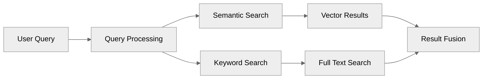

# PostgreSQL with pgvector: The Complete Vector Database Guide

This comprehensive guide walks you through setting up PostgreSQL as a powerful vector database using the pgvector extension. You'll learn how to implement semantic search, keyword search, and advanced hybrid search capabilities that combine the best of both approaches.

## Table of Contents

1. [Introduction](#introduction)
2. [Why PostgreSQL for Vector Search](#why-postgresql-for-vector-search)
3. [Docker Setup](#docker-setup)
4. [Database Configuration](#database-configuration)
5. [Understanding Vector Indexes](#understanding-vector-indexes)
6. [Basic Vector Operations](#basic-vector-operations)
7. [SQLAlchemy Integration](#sqlalchemy-integration)
8. [Advanced Hybrid Search](#advanced-hybrid-search)
9. [Metadata Filtering](#metadata-filtering)
10. [Additional Resources](#additional-resources)

## Introduction

Vector databases have become essential infrastructure for modern AI applications, enabling semantic search, recommendation systems, and retrieval-augmented generation (RAG). While specialized vector databases exist, PostgreSQL with pgvector offers a compelling alternative that combines vector capabilities with the robustness of a mature relational database.

This guide takes you from zero to production-ready vector search implementation. You'll start with basic operations and progress to sophisticated hybrid search algorithms that match or exceed the capabilities of dedicated vector databases. By the end, you'll understand not just how to implement vector search, but why each design decision matters for performance and accuracy.

## Why PostgreSQL for Vector Search

PostgreSQL with pgvector provides several advantages over specialized vector databases:

**Unified Data Platform**: Instead of managing separate databases for structured and vector data, PostgreSQL handles both seamlessly. This reduces operational complexity and enables powerful queries that combine vector similarity with traditional SQL filters.

**Production-Proven Reliability**: PostgreSQL brings decades of battle-tested reliability, ACID compliance, and robust backup/recovery mechanisms. Your vector data benefits from the same enterprise-grade features that protect critical business data.

**Cost Efficiency**: Open-source PostgreSQL eliminates licensing costs while providing performance that rivals commercial alternatives. The pgvector extension is also open-source and actively maintained.

**Flexible Deployment**: Whether you're running locally, on-premises, or in the cloud, PostgreSQL works everywhere. This flexibility extends from development laptops to massive production deployments.

## Docker Setup

Our Docker configuration provides a complete PostgreSQL environment with pgvector pre-installed. This approach ensures consistency across development and production environments while simplifying the setup process.

### Understanding the Docker Configuration

The `docker/docker-compose.yml` file defines our PostgreSQL service with pgvector. Key aspects include:

- **Official pgvector Image**: We use `pgvector/pgvector:pg17` which includes PostgreSQL 17 with pgvector pre-installed
- **Persistent Storage**: Named volumes ensure data survives container restarts
- **Health Checks**: Automatic health monitoring ensures the database is ready before accepting connections
- **Initialization Scripts**: Custom SQL runs on first startup to configure the database

### Database Initialization

The `docker/init.sql` script sets up the foundation for vector operations. This script is automatically executed when the PostgreSQL container starts for the first time through Docker's initialization mechanism.

**How Docker Executes Initialization Scripts:**

The official PostgreSQL Docker image includes a special directory `/docker-entrypoint-initdb.d/` that is scanned during container initialization. Any `.sql`, `.sql.gz`, or `.sh` files found in this directory are executed in alphabetical order when:

1. The container is started for the first time
2. The data directory is empty (no existing database)

Our Docker Compose configuration mounts the local `init.sql` file into this special directory:

```yaml
volumes:
  - ./init.sql:/docker-entrypoint-initdb.d/init.sql
```

This means when you run `docker compose up` for the first time, PostgreSQL will:
1. Initialize the database cluster
2. Start the PostgreSQL server
3. Execute our `init.sql` script to create tables and indexes
4. Mark the initialization as complete

**Important Notes:**
- The script only runs on first initialization, not on subsequent container restarts
- If you need to re-run the initialization, you must remove the data volume: `docker compose down -v`
- The script runs as the PostgreSQL superuser, so it has full permissions

**What Our init.sql Creates:**

1. **Extension Activation**: Enables the pgvector extension, adding support for vector data types and similarity search operations

2. **Table Creation**: Creates a `documents` table with:
   - `id`: Auto-incrementing primary key using `BIGINT GENERATED ALWAYS AS IDENTITY`
   - `content`: Text field for storing document content
   - `metadata`: JSON field for flexible metadata storage
   - `embedding`: Vector column configured for 1536-dimensional vectors (matching OpenAI's embedding dimensions)
   - `fts`: Auto-generated full-text search vector using PostgreSQL's `to_tsvector` function
   - `created_at`: Timestamp with timezone, automatically set on insert

3. **Index Configuration**: Creates three specialized indexes:
   - **HNSW Index** on embeddings: Uses `vector_ip_ops` (inner product) for fast similarity search. We chose HNSW over IVFFlat for better recall and query performance
   - **GIN Index** on FTS: Enables efficient full-text search queries
   - **GIN Index** on metadata: Allows fast filtering on JSON fields

The script follows [Supabase's best practices](https://supabase.com/docs/guides/ai/vector-indexes/hnsw-indexes) for vector index configuration. The use of `vector_ip_ops` (inner product) is optimal for normalized vectors like those from OpenAI, providing better computational efficiency than cosine similarity while yielding identical results for normalized vectors.

### Starting the Database

Navigate to the docker directory and start the services:

```bash
cd docker
docker compose up -d
```

Verify the database is running:

```bash
docker exec -it pgvector-db psql -U postgres -c "SELECT version();"
```

## Database Configuration

### Connection Parameters

The PostgreSQL instance is accessible at:
- Host: `localhost`
- Port: `5432`
- Database: `postgres`
- Username: `postgres`
- Password: `postgres`

### Initial Schema Design

Our schema demonstrates best practices for vector storage. The `documents` table includes:

- **Vector Column**: Stores high-dimensional embeddings with configurable dimensions
- **Text Content**: Original text for retrieval and display
- **JSON Metadata**: Flexible metadata storage using PostgreSQL's JSONB type
- **Full-Text Search**: Automatically generated tsvector for keyword search
- **Timestamps**: Automatic creation timestamps for data management

## Understanding Vector Indexes

Vector indexes are crucial for performance at scale. PostgreSQL with pgvector supports two index types, both with distinct characteristics and use cases. In our implementation, we use HNSW following Supabase's recommendations, but understanding all options helps you make informed decisions for your specific use case.

### Why We Use HNSW (Despite Having Under 1M Vectors)

Our `init.sql` creates an HNSW index even though our dataset is small:

```sql
CREATE INDEX IF NOT EXISTS documents_embedding_idx ON documents USING hnsw (embedding vector_ip_ops);
```

This follows [Supabase's default recommendation](https://supabase.com/docs/guides/ai/vector-indexes/hnsw-indexes) because:

1. **Future-Proofing**: HNSW scales better as your dataset grows
2. **Superior Recall**: Consistently achieves 95%+ recall vs. 90-95% for IVFFlat
3. **Query Performance**: Faster searches once the index is built
4. **Production Standard**: Most production systems use HNSW regardless of initial size

The main trade-off is slower index building and higher memory usage, but for most applications, these costs are worth the benefits.

### IVFFlat Index

IVFFlat (Inverted File with Flat Quantization) divides the vector space into regions, dramatically reducing search scope. Think of it as organizing books in a library by genre - you only search the relevant section rather than scanning every book.

**When to Consider IVFFlat**:
- Extremely memory-constrained environments
- Need very fast index builds (e.g., frequently recreated indexes)
- Willing to trade some accuracy for resource efficiency
- Temporary or experimental workloads

**Configuration Example**:
```sql
CREATE INDEX ON documents USING ivfflat (embedding vector_cosine_ops) WITH (lists = 100);
```

The `lists` parameter determines the number of clusters. A good starting point is `rows/1000` for datasets under 1 million rows.

**Important Warning for Testing**: If you have very few rows (e.g., < 1000) and set `lists` to 100, IVFFlat may not return any results! This happens because pgvector requires at least a certain number of vectors per cluster to function properly. For testing with small datasets:
- Use `lists = 1` for datasets under 100 rows
- Use `lists = rows/10` for datasets under 1000 rows
- This is another reason why HNSW is preferred - it works reliably regardless of dataset size

### HNSW Index

HNSW (Hierarchical Navigable Small World) builds a multi-layer graph structure that enables extremely fast searches with excellent recall. It's like having multiple maps at different zoom levels - you quickly narrow down the region before detailed searching.

**Why HNSW is the Production Standard**:
- **Best Recall**: Consistently finds the most relevant results
- **Fast Queries**: After initial build, query performance is excellent
- **Predictable Performance**: More consistent across different data distributions
- **Well-Tested**: Proven in production at scale

**Default Configuration** (what we use):
```sql
CREATE INDEX ON documents USING hnsw (embedding vector_ip_ops);
```

**Advanced Configuration** (for tuning):
```sql
CREATE INDEX ON documents USING hnsw (embedding vector_ip_ops) WITH (m = 16, ef_construction = 64);
```

Parameters explained:
- `m`: Connections per node (default 16, higher = better recall, more memory)
- `ef_construction`: Construction-time accuracy (default 64, higher = better index quality, slower build)

### The Inner Product Nuance

You'll notice we use `vector_ip_ops` (inner product) rather than `vector_cosine_ops` (cosine similarity). This is a critical optimization that often confuses developers:

**For Normalized Vectors (like OpenAI embeddings)**:
- Inner product and cosine similarity give **identical rankings** 
- Inner product is **computationally faster** (no normalization step)
- OpenAI embeddings are pre-normalized to unit length
- Therefore: always use `vector_ip_ops` with OpenAI embeddings

**Mathematical Explanation**:
```
For normalized vectors where ||v|| = 1:
cosine_similarity(a, b) = a · b / (||a|| × ||b||) = a · b / (1 × 1) = a · b
inner_product(a, b) = a · b

Result: They're identical, but inner product skips the division!
```

**When to Use Each Operator**:
- `vector_ip_ops`: OpenAI, Cohere, and most modern embedding models (pre-normalized)
- `vector_cosine_ops`: Older models or custom embeddings that aren't normalized
- `vector_l2_ops`: When actual distance matters (rare in search applications)


## Basic Vector Operations

The `1-basic-operations.py` file demonstrates fundamental vector operations using direct PostgreSQL connections. This approach provides maximum control and transparency.

### Key Concepts Demonstrated

**Direct SQL Operations**: Working directly with SQL helps you understand exactly how vector operations work. You'll see how embeddings are stored, indexed, and queried.

**Embedding Generation**: The example shows how to generate embeddings using OpenAI's API. The process involves:
1. Sending text to the embedding API
2. Receiving a high-dimensional vector representation
3. Storing this vector in PostgreSQL

**Similarity Search**: The core of vector search involves finding vectors closest to a query vector. PostgreSQL makes this elegant with operators like `<#>` for inner product.

### Why Start with Basic Operations?

Understanding the fundamentals is crucial because:
- It demystifies what higher-level abstractions do
- It helps debug issues when they arise
- It provides insights for optimization
- It enables custom implementations when needed

## SQLAlchemy Integration

The `2-sqlalchemy-example.py` demonstrates using SQLAlchemy ORM for vector operations. This approach provides several advantages for application development.

### Benefits of SQLAlchemy Integration

**Type Safety**: SQLAlchemy's type system integrates with pgvector, providing compile-time checks and IDE support.

**Abstraction Without Magic**: While SQLAlchemy abstracts SQL generation, you maintain full control over vector operations. The ORM handles routine tasks while exposing vector-specific functionality.

**Relationship Management**: Complex applications often need relationships between vector data and other entities. SQLAlchemy excels at managing these relationships efficiently.

### Implementation Highlights

The example shows:
- Defining vector columns in SQLAlchemy models
- Integrating vector search with traditional queries
- Implementing metadata filtering alongside vector search
- Managing sessions and transactions properly

### When to Use SQLAlchemy

Choose SQLAlchemy when:
- Building larger applications with complex data models
- Working in teams that benefit from ORM conventions
- Needing migration management and schema versioning
- Wanting better testing capabilities through ORM features

## Advanced Hybrid Search

The `3-hybrid-search.py` implements a sophisticated hybrid search system that combines semantic and keyword search. This approach often outperforms pure vector search for real-world applications.



### Understanding Hybrid Search

Hybrid search addresses limitations of both semantic and keyword search:

**Semantic Search Strengths**:
- Understands context and meaning
- Handles synonyms and related concepts
- Works across languages
- Finds conceptually similar content

**Keyword Search Strengths**:
- Exact term matching
- Handles specific names, codes, or identifiers
- Predictable results
- Computationally efficient

By combining both approaches, hybrid search delivers superior results. For example, searching for "Italian recipes with tomato sauce" benefits from:
- Keyword matching for "Italian" and "tomato sauce"
- Semantic understanding to include "pasta marinara" or "pomodoro dishes"

### Reciprocal Rank Fusion (RRF)

Our implementation uses the [RRF algorithm implementation from Supabase](https://supabase.com/docs/guides/ai/hybrid-search#reciprocal-ranked-fusion-rrf) to combine results from different search methods. RRF is elegant and effective:

1. Each search method produces a ranked list
2. Items receive scores based on their rank: `1 / (k + rank)`
3. Scores are summed across methods
4. Final ranking uses combined scores

The smoothing constant `k` (default 50) prevents extreme scores for top-ranked items while maintaining meaningful differences.

### Full-Text Search in PostgreSQL

PostgreSQL's full-text search provides powerful keyword matching capabilities:

**Text Processing**: Documents are processed into tokens, removing stop words and normalizing terms. This creates a `tsvector` that's optimized for searching.

**Example of Text to Token Conversion**:
```sql
-- Original text
SELECT to_tsvector('english', 'Machine learning models transform text into vectors');
-- Result: 'learn':2 'machin':1 'model':3 'text':5 'transform':4 'vector':7

-- Query processing
SELECT websearch_to_tsquery('english', 'machine learning');
-- Result: 'machin' & 'learn'

-- Notice how:
-- - "Machine" becomes "machin" (stemming)
-- - "learning" becomes "learn" (stemming)
-- - Common words like "into" are removed (stop words)
-- - Position information is preserved for ranking
```

**Query Flexibility**: Our implementation supports two modes:
- **Strict Mode**: Uses `websearch_to_tsquery` for Google-like syntax
- **Flexible Mode**: Custom logic that builds OR queries from available terms

**Performance**: GIN indexes on `tsvector` columns enable millisecond queries even on millions of documents.

### Strict vs Flexible Keyword Modes

**Strict Mode** (`websearch_to_tsquery`):
- Requires all terms to match
- Supports advanced syntax (phrases, exclusions)
- Better for precise, technical searches
- May return no results for conversational queries

**Flexible Mode** (custom implementation):
- Matches any term present in documents
- Extracts meaningful terms automatically
- Better for conversational, exploratory searches
- Always returns some results if possible

## Metadata Filtering

Metadata filtering adds another dimension to search, enabling precise control over results. Our implementation seamlessly integrates with both vector and keyword search.

### How Metadata Filtering Works

PostgreSQL's JSON type enables efficient filtering on arbitrary metadata:

1. **Storage**: Metadata is stored as JSON, allowing flexible schemas
2. **Indexing**: GIN indexes on JSON enable fast filtering
3. **Querying**: The `->` and `->>` operators extract and compare values
4. **Integration**: Filters apply within CTEs for optimal performance

### Implementation Details

The hybrid search function accepts metadata filters as a dictionary:

```python
results = search_engine.search(
    query="database tutorials",
    metadata_filter={"category": "database", "level": "beginner"}
)
```

This translates to SQL conditions that filter results before ranking, ensuring efficiency even with complex filters.

### Extending Metadata Filtering for Advanced Queries

The current implementation supports exact matches, but you may need comparison operators for dates or numeric values. Here's how to extend it:

**Current Implementation** (equality only):
```python
# This works for exact matches
metadata_filter={"category": "database", "level": "beginner"}
# Generates: metadata->>'category' = 'database' AND metadata->>'level' = 'beginner'
```

**Extended Implementation** for comparisons:
```python
# For date/number comparisons, you'd need to modify the filter format:
metadata_filter={
    "price": {"$lte": 100},
    "created_date": {"$gte": "2024-01-01"},
    "rating": {"$between": [4.0, 5.0]}
}

# In your search implementation, parse these operators:
for key, value in metadata_filter.items():
    if isinstance(value, dict):
        operator = list(value.keys())[0]
        if operator == "$lte":
            conditions.append(f"(metadata->>%s)::numeric <= %s")
        elif operator == "$gte":
            conditions.append(f"(metadata->>%s)::date >= %s")
        elif operator == "$between":
            conditions.append(f"(metadata->>%s)::numeric BETWEEN %s AND %s")
```

**Important Considerations**:
- **Type Casting**: JSON values are text, so cast to appropriate types (`::numeric`, `::date`)
- **Indexing**: For range queries, consider expression indexes:
  ```sql
  CREATE INDEX idx_metadata_price ON documents ((metadata->>'price')::numeric);
  ```
- **Validation**: Ensure proper error handling for invalid type conversions

### Best Practices for Metadata

**Schema Design**: While JSON is flexible, consistent metadata schemas improve performance and usability.

**Indexing Strategy**: Create GIN indexes for frequently filtered fields:
```sql
CREATE INDEX idx_metadata_category ON documents ((metadata->>'category'));
```

**Query Patterns**: Combine metadata filters with tor search for powerful queries like "beginner Python tutorials similar to this example."

## Additional Resources

- [pgvector GitHub Repository](https://github.com/pgvector/pgvector) - Official documentation and examples
- [Supabase Vector Guides](https://supabase.com/docs/guides/ai) - Excellent tutorials and best practices
- [PostgreSQL Full-Text Search](https://www.postgresql.org/docs/current/textsearch.html) - Deep dive into text search
- [OpenAI Embeddings Guide](https://platform.openai.com/docs/guides/embeddings) - Understanding embedding models
- [Reciprocal Rank Fusion Paper](https://plg.uwaterloo.ca/~gvcormac/cormacksigir09-rrf.pdf) - Original RRF research

## Conclusion

PostgreSQL with pgvector provides a robust, production-ready platform for vector search applications. By combining vector capabilities with PostgreSQL's strengths in relational data, full-text search, and operational maturity, you can build sophisticated search systems that scale from prototype to production.

The examples in this repository demonstrate the progression from basic concepts to advanced implementations. Start with direct SQL operations to understand the fundamentals, explore SQLAlchemy for application development, and leverage hybrid search for optimal results. With this foundation, you're ready to build AI-powered applications that deliver exceptional search experiences.