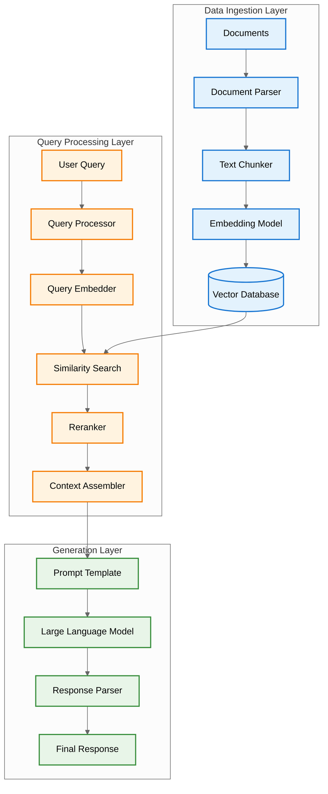
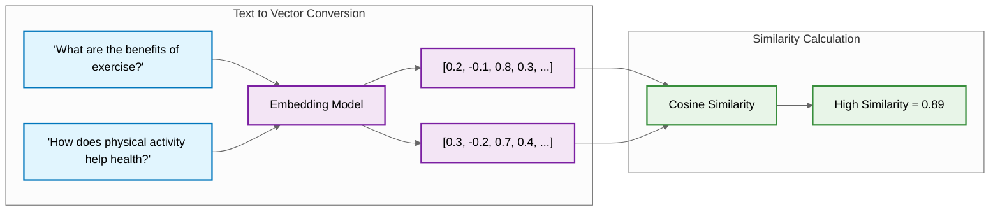
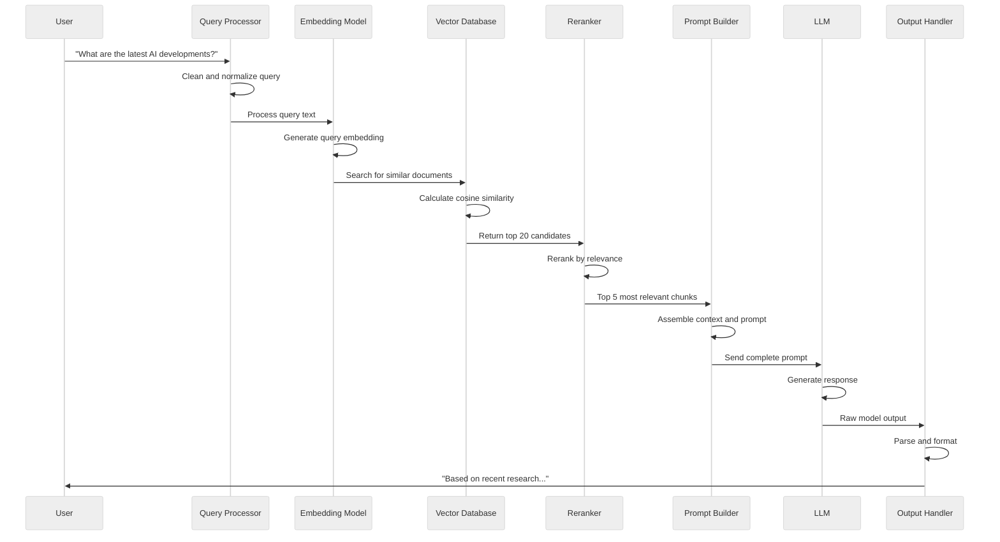
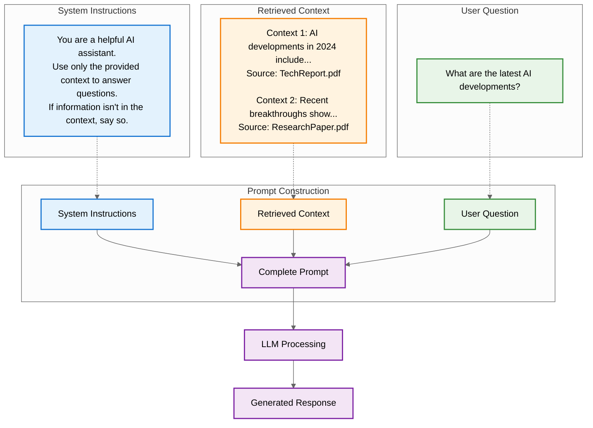

# Understanding Retrieval Augmented Generation (RAG)

Welcome to your introduction to Retrieval Augmented Generation (RAG) - one of the most powerful and practical techniques in modern AI engineering. This guide will help you understand what RAG is, why it's essential for building production AI applications, and how the different components work together to create intelligent systems.

## What is RAG?

Think of RAG as giving your AI system access to an "open-book exam." While traditional language models are limited to the knowledge they were trained on, RAG systems can access external information sources to provide more accurate, up-to-date, and contextually relevant responses.

RAG solves a fundamental problem with Large Language Models (LLMs): they have static knowledge that becomes outdated and may not include your organization's specific information. Instead of trying to cram all possible knowledge into the model's parameters during training, RAG acknowledges that certain information is better stored externally and retrieved when needed.

### The RAG Advantage

RAG offers several critical benefits over standalone LLMs:

- **Knowledge Extensibility**: You can continuously update your knowledge sources without retraining the model
- **Transparency**: Responses can be traced back to specific sources, creating accountability
- **Reduced Hallucinations**: By grounding responses in retrieved facts, RAG significantly reduces the LLM's tendency to generate plausible-sounding but incorrect information
- **Cost Efficiency**: Storing knowledge externally is more cost-effective than increasing model size

## The Two-Phase RAG Process

RAG systems operate in two distinct phases that work together seamlessly:

### 1. Retrieval Phase
The retrieval phase is like having an intelligent research assistant that finds relevant information based on your question. This involves:
- Converting your query into a format the system can search with
- Finding semantically similar content in the knowledge base
- Selecting the most relevant documents or passages
- Preparing this information for the LLM to use

### 2. Generation Phase
The generation phase is where the LLM synthesizes the retrieved information with your question to create a coherent, contextually appropriate response. The LLM uses its reasoning capabilities to:
- Analyze the retrieved information
- Apply it to your specific question
- Generate a response that incorporates the external knowledge
- Cite sources when appropriate

## How RAG Works: The Complete Pipeline

Let's walk through what happens when you ask a RAG system a question. The following diagram shows the complete process from your question to the final answer:



### Understanding the Data Flow

The diagram above shows three distinct layers that work together:

- **Data Ingestion Layer (Blue)**: This happens offline, before any user queries. Your documents are parsed, split into manageable chunks, converted into mathematical representations called embeddings, and stored in a specialized vector database.
- **Query Processing Layer (Orange)**: This happens in real-time when you ask a question. Your query gets processed and converted into the same mathematical format as the stored documents, allowing the system to find semantically similar content.
- **Generation Layer (Green)**: The retrieved context gets formatted into a prompt template and sent to the LLM, which generates a response based on both your question and the relevant retrieved information.

## Vector Embeddings: Making Meaning Searchable

One of the most crucial concepts in RAG is vector embeddings. Think of embeddings as a way to convert text into a mathematical "fingerprint" that captures its meaning.



Traditional keyword search would struggle to connect "benefits of exercise" with "physical activity helps health" because they don't share common words. Vector embeddings capture semantic meaning, allowing the system to understand that these phrases are related conceptually, even with different vocabulary.

This is why RAG systems can find relevant information even when your question uses different terminology than the source documents. The embedding model has learned to represent similar concepts with similar mathematical patterns.

## The Query Lifecycle: From Question to Answer

When you ask a RAG system a question, here's the detailed sequence of what happens:



### Understanding Each Step

1. **Query Processing**: Your question gets cleaned and prepared for embedding
2. **Embedding Generation**: The query is converted into a vector representation
3. **Similarity Search**: The system finds documents with similar vector representations
4. **Reranking**: A more sophisticated model refines the selection for quality
5. **Context Assembly**: The best chunks are formatted for the LLM
6. **Prompt Construction**: Your question and context are combined into a structured prompt
7. **Generation**: The LLM creates a response based on the augmented prompt
8. **Output Processing**: The response is formatted and returned to you

## Context Injection: How Retrieved Information Reaches the LLM

The magic of RAG happens when retrieved information gets combined with your original question. This process, called context injection, follows a structured pattern:



### The Anatomy of a RAG Prompt

A well-constructed RAG prompt contains three essential components:

1. **System Instructions**: Clear guidelines that define the assistant's role and constraints
2. **Retrieved Context**: Formatted chunks of relevant information with source attribution
3. **User Question**: The original query, clearly marked and preserved

### Example Prompt

```text
# Role and Objective
You are an expert assistant. Your task is to answer the user’s query using only the provided context. Do not use outside knowledge or make unsupported claims.

# Instructions
- Carefully read the user’s question.
- Review the provided context documents.
- If the answer is found in the context, cite the relevant sources using their indices.
- If the information is missing or insufficient, state this clearly.
- Think step by step and explain your reasoning before giving the final answer.
- Do not guess or fabricate information.

# Context
[Insert retrieved documents or excerpts here, each labeled with a unique index.]

# Reasoning Steps
- Analyze the question and identify key requirements.
- Search the context for relevant information.
- Explain how the context supports your answer, citing sources.
- If context is lacking, describe what is missing.

# Output Format
- Provide a concise, well-structured answer.
- Use markdown headers and lists where appropriate.
- Include citations in brackets after each relevant statement.
- Do not include references or links at the end.

# User Query
[Insert user question here]

# Final Instructions
- Only answer based on the provided context.
- Be concise, accurate, and avoid repetition.
```

This structure ensures the LLM understands its role, has access to relevant information, and knows exactly what question to answer.

## Best Practices for RAG Implementation

### Document Preparation
- **Chunk Size**: Aim for 500-1000 tokens per chunk to balance context and specificity
- **Overlap**: Use 10-20% overlap between chunks to avoid losing information at boundaries
- **Metadata**: Include rich metadata (source, date, author, tags) to enable filtering
- **Quality Control**: Remove or clean low-quality content before ingestion

### Retrieval Optimization
- **Multiple Retrievers**: Combine semantic and keyword search for better coverage
- **Query Expansion**: Use techniques like query rewriting or expansion to improve recall
- **Reranking**: Implement a second-stage ranking model for better precision
- **Filtering**: Use metadata filters to narrow results to relevant subsets

### Generation Quality
- **Clear Instructions**: Provide specific, detailed instructions in your system prompts
- **Source Attribution**: Include source information in retrieved context
- **Confidence Indicators**: Train the LLM to express uncertainty when appropriate
- **Output Validation**: Implement checks for response quality and relevance
