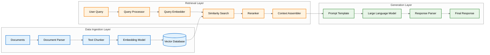
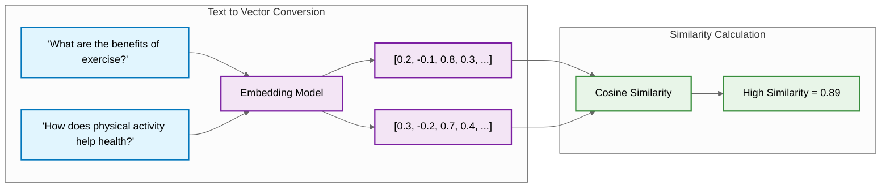
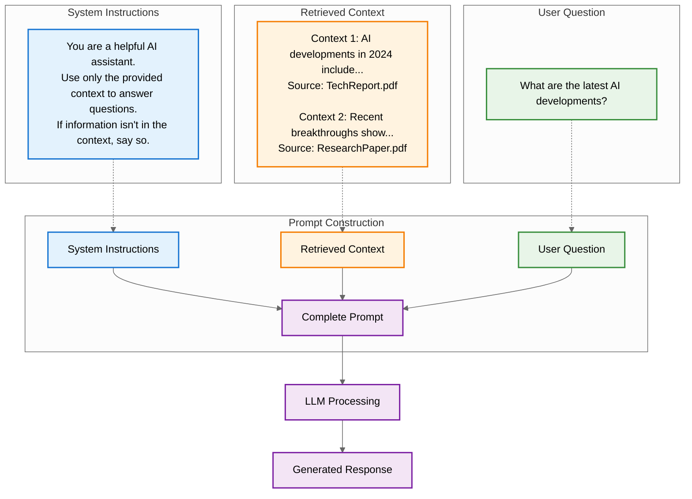

# Understanding Retrieval Augmented Generation (RAG)

Welcome to your introduction to Retrieval Augmented Generation (RAG) - one of the most powerful and practical techniques in modern AI engineering. This guide will help you understand what RAG is, why it's essential for building production AI applications, and how the different components work together to create intelligent systems.

## Table of Contents

- [Understanding Retrieval Augmented Generation (RAG)](#understanding-retrieval-augmented-generation-rag)
  - [Table of Contents](#table-of-contents)
  - [What is RAG?](#what-is-rag)
    - [The RAG Advantage](#the-rag-advantage)
  - [The Two-Phase RAG Process](#the-two-phase-rag-process)
    - [1. Retrieval Phase](#1-retrieval-phase)
    - [2. Generation Phase](#2-generation-phase)
  - [How RAG Works: The Complete Pipeline](#how-rag-works-the-complete-pipeline)
    - [Understanding the Data Flow](#understanding-the-data-flow)
  - [Understanding Vector Embeddings](#understanding-vector-embeddings)
    - [What are Vector Embeddings?](#what-are-vector-embeddings)
    - [How Embeddings Make Meaning Searchable](#how-embeddings-make-meaning-searchable)
    - [Popular Embedding Models](#popular-embedding-models)
    - [Key Considerations](#key-considerations)
    - [Getting Started](#getting-started)
  - [Understanding Cosine Similarity and Vector Distance](#understanding-cosine-similarity-and-vector-distance)
    - [What is Cosine Similarity?](#what-is-cosine-similarity)
    - [The Inner Product for Normalized Vectors](#the-inner-product-for-normalized-vectors)
  - [Context Injection: How Retrieved Information Reaches the LLM](#context-injection-how-retrieved-information-reaches-the-llm)
  - [The Anatomy of a RAG Prompt](#the-anatomy-of-a-rag-prompt)
    - [Example Prompt](#example-prompt)

## What is RAG?

Think of RAG as giving your AI system access to an "open-book exam." While traditional language models are limited to the knowledge they were trained on, RAG systems can access external information sources to provide more accurate, up-to-date, and contextually relevant responses.

RAG solves a fundamental problem with Large Language Models (LLMs): they have static knowledge that becomes outdated and may not include your organization's specific information. Instead of trying to cram all possible knowledge into the model's parameters during training, RAG acknowledges that certain information is better stored externally and retrieved when needed.

### The RAG Advantage

RAG offers several critical benefits over standalone LLMs:

- **Knowledge Extensibility**: You can continuously update your knowledge sources without retraining the model
- **Transparency**: Responses can be traced back to specific sources, creating accountability
- **Reduced Hallucinations**: By grounding responses in retrieved facts, RAG significantly reduces the LLM's tendency to generate plausible-sounding but incorrect information
- **Cost Efficiency**: Storing knowledge externally is more cost-effective than increasing model size

## The Two-Phase RAG Process

RAG systems operate in two distinct phases that work together seamlessly:

### 1. Retrieval Phase
The retrieval phase is like having an intelligent research assistant that finds relevant information based on your question. This involves:
- Converting your query into a format the system can search with
- Finding semantically similar content in the knowledge base
- Selecting the most relevant documents or passages
- Preparing this information for the LLM to use

### 2. Generation Phase
The generation phase is where the LLM synthesizes the retrieved information with your question to create a coherent, contextually appropriate response. The LLM uses its reasoning capabilities to:
- Analyze the retrieved information
- Apply it to your specific question
- Generate a response that incorporates the external knowledge
- Cite sources when appropriate

## How RAG Works: The Complete Pipeline

Let's walk through what happens when you ask a RAG system a question. The following diagram shows the complete process from your question to the final answer:



### Understanding the Data Flow

The diagram above shows three distinct layers that work together:

- **Data Ingestion Layer (Blue)**: This happens offline, before any user queries. Your documents are parsed, split into manageable chunks, converted into mathematical representations called embeddings, and stored in a specialized vector database.
- **Query Processing Layer (Orange)**: This happens in real-time when you ask a question. Your query gets processed and converted into the same mathematical format as the stored documents, allowing the system to find semantically similar content.
- **Generation Layer (Green)**: The retrieved context gets formatted into a prompt template and sent to the LLM, which generates a response based on both your question and the relevant retrieved information.

## Understanding Vector Embeddings

[Vector embeddings](https://platform.openai.com/docs/guides/embeddings) are the foundation of semantic search in RAG systems. They convert text into numerical vectors that capture meaning, allowing computers to understand relationships between words and phrases.

### What are Vector Embeddings?

Think of vector embeddings as a way to translate human language into a mathematical space where similar concepts are positioned close together. Each word or phrase becomes a point in this high-dimensional space, and the distance between points represents their semantic similarity.

<div align="center">

</div>

### How Embeddings Make Meaning Searchable

One of the most crucial concepts in RAG is how vector embeddings enable semantic search. Think of embeddings as a way to convert text into a mathematical "fingerprint" that captures its meaning.



Traditional keyword search would struggle to connect "benefits of exercise" with "physical activity helps health" because they don't share common words. Vector embeddings capture semantic meaning, allowing the system to understand that these phrases are related conceptually, even with different vocabulary.

This is why RAG systems can find relevant information even when your question uses different terminology than the source documents. The embedding model has learned to represent similar concepts with similar mathematical patterns.

### Popular Embedding Models

Several embedding models are commonly used in production RAG systems:

1. **OpenAI Embeddings**
   - `text-embedding-3-small`: 1536 dimensions, fast and efficient
   - `text-embedding-3-large`: 3072 dimensions, higher accuracy
   - Best for: General-purpose applications, English text

2. **Open Source Alternatives**
   - `all-MiniLM-L6-v2`: 384 dimensions, lightweight
   - `BAAI/bge-small-en`: 384 dimensions, good performance
   - Best for: Cost-sensitive applications, non-English text

3. **Specialized Models**
   - `intfloat/e5-large`: Optimized for retrieval
   - `BAAI/bge-large-en`: Strong performance on benchmarks
   - Best for: High-accuracy requirements, multilingual support

### Key Considerations

When choosing an embedding model, consider:

- **Dimension Size**: Higher dimensions can capture more nuance but require more storage
- **Model Size**: Larger models are more accurate but slower and more expensive
- **Language Support**: Some models work better with specific languages
- **Domain Specialization**: Consider models trained on domain-specific data
- **Cost**: Balance between API costs and self-hosted infrastructure

### Getting Started

The `embeddings.py` file in this repository provides a simple example of working with embeddings:

```python
# Create embeddings
text = "I love programming in Python"
embedding = create_embedding(text)

# Calculate similarity
similarity = calculate_similarity(embedding1, embedding2)
```

This example demonstrates:
- Creating embeddings using OpenAI's API
- Calculating similarity between texts
- Understanding how different phrases relate to each other

Try running the example with different texts to see how the similarity scores change based on meaning rather than just word overlap.

## Understanding Cosine Similarity and Vector Distance

When working with vector embeddings, we need a way to measure how similar two pieces of text are. This is where cosine similarity comes in - it's the mathematical foundation that makes semantic search possible.

### What is Cosine Similarity?

Cosine similarity measures the angle between two vectors in high-dimensional space. Instead of caring about the magnitude (length) of the vectors, it focuses purely on their direction. This makes it perfect for comparing text embeddings. For the mathematical formula and detailed explanation, see the [Wikipedia article on Cosine Similarity](https://en.wikipedia.org/wiki/Cosine_similarity). 

The result is always between -1 and 1:
- **1**: Vectors point in exactly the same direction (identical meaning)
- **0**: Vectors are perpendicular (unrelated meanings)
- **-1**: Vectors point in opposite directions (opposite meanings)

### The Inner Product for Normalized Vectors

Modern embedding models like OpenAI's `text-embedding-3` series produce **normalized vectors** - vectors with a magnitude of 1. This has a beautiful mathematical property:

**For normalized vectors, the dot product equals the cosine similarity**

This is why you'll often see code using the inner product (dot product) directly:

```python
# For normalized embeddings (like OpenAI's)
similarity = np.dot(embedding1, embedding2)

# This is mathematically equivalent to:
similarity = cosine_similarity(embedding1, embedding2)
```

The inner product is computationally faster since it skips the normalization step, making it the preferred choice for production systems using normalized embeddings.

**Note on PGVector**: In PostgreSQL with PGVector, the `<#>` operator computes the **negative** inner product. This means for normalized vectors, you'll often see `-(embedding <#> query)` in SQL queries to get the standard similarity score (-1 to 1 range). This maintains the same mathematical meaning as cosine similarity but with faster computation.

## Context Injection: How Retrieved Information Reaches the LLM

The magic of RAG happens when retrieved information gets combined with your original question. This process, called context injection, follows a structured pattern:



## The Anatomy of a RAG Prompt

A well-constructed RAG prompt contains three essential components:

1. **System Instructions**: Clear guidelines that define the assistant's role and constraints
2. **Retrieved Context**: Formatted chunks of relevant information with source attribution
3. **User Question**: The original query, clearly marked and preserved

### Example Prompt

```text
You are a helpful assistant. Answer the user's question using ONLY the provided context.
If the answer isn't in the context, say so clearly.

Context:
[Retrieved documents will be inserted here]

Question: [User's question will be inserted here]

Instructions:
- Base your answer solely on the provided context
- Cite sources when making claims
- If information is missing, acknowledge it
- Be concise and accurate
``` 