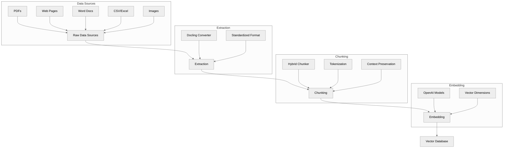

# Vectorization Pipeline

This guide explains the process of preparing data for vector databases and RAG (Retrieval-Augmented Generation) systems. The pipeline consists of three main steps: extraction, chunking, and embedding.

## Process Overview

## Pipeline Components

### 1. Extraction

The first step is extracting text from various document formats using [`1-extraction.py`](1-extraction.py). We use [Docling](https://docling-project.github.io/docling/) for this purpose because:

- **Unified Interface**: Handles multiple document types (PDF, DOCX, HTML, etc.)
- **Standardized Output**: Converts all documents to a consistent format
- **Advanced Features**: Handles complex layouts, tables, and OCR
- **Type Safety**: Uses Pydantic models for strict type checking

Example use cases:
- Research papers (PDF)
- Company documentation (Word/PDF)
- Web content (HTML)
- Structured data (CSV/Excel)
- Scanned documents (Images with OCR)

### 2. Chunking

Chunking is crucial for RAG performance using [`2-chunking.py`](2-chunking.py). We use [Docling's HybridChunker](https://docling-project.github.io/docling/examples/hybrid_chunking/) because it:

- **Preserves Context**: Maintains document structure and hierarchy
- **Token-Aware**: Respects model token limits
- **Semantic Boundaries**: Splits at logical points (sections, paragraphs)
- **Overlap Control**: Manages chunk overlap for context continuity

Key considerations:
- Chunk size affects retrieval quality
- Too small: Loses context
- Too large: Dilutes relevance
- Overlap helps maintain context between chunks

### 3. Embedding

The final step converts text chunks into vector embeddings using [`3-embeddings.py`](3-embeddings.py) and OpenAI's models:

- **text-embedding-3-small**: 1536 dimensions, faster, cheaper
- **text-embedding-3-large**: 3072 dimensions, more accurate

Important factors:
- Model selection based on:
  - Accuracy requirements
  - Cost constraints
  - Performance needs
- Batch processing for efficiency
- Token limits and pricing

## Best Practices

1. **Document Processing**:
   - Use Docling for consistent extraction
   - Handle different document types uniformly
   - Preserve document structure

2. **Chunking Strategy**:
   - Consider your use case
   - Balance chunk size and overlap
   - Test different chunking approaches

3. **Embedding Selection**:
   - Choose model based on needs
   - Consider cost vs. performance
   - Monitor token usage

## Additional Resources

- [Docling Documentation](https://docling-project.github.io/docling/)
- [OpenAI Embeddings Guide](https://platform.openai.com/docs/guides/embeddings)
