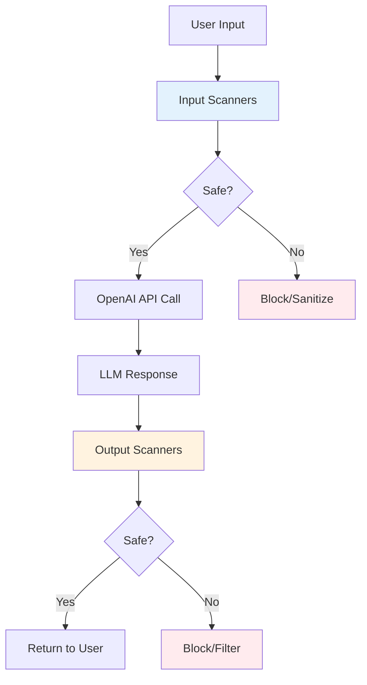

# LLM Guard Security Examples

## What is LLM Guard?

LLM Guard is a **comprehensive security toolkit** that acts as a protective layer for Large Language Model applications. Unlike traditional API-based security solutions, LLM Guard runs **entirely on your machine** using open-source transformer models from [Hugging Face](https://huggingface.co/), giving you complete control over your data and security policies.

### How LLM Guard Fits Into Your Workflow



## Two-Layer Security Architecture

LLM Guard provides **two types of scanners** that work together to secure your LLM pipeline:

### 🔍 **Input Scanners** - Pre-Processing Protection
Process and secure user prompts **before** they reach your LLM:

- **[Anonymize](https://protectai.github.io/llm-guard/input_scanners/anonymize/)**: Remove PII (names, emails, phone numbers) before sending to APIs
- **Prompt Injection Detection**: Block attempts to manipulate your AI system
- **Toxicity Detection**: Filter harmful or offensive content
- **Secrets Detection**: Prevent API keys and credentials from being exposed
- **Ban Competitors**: Remove mentions of competitor brands from prompts

### 🛡️ **Output Scanners** - Post-Processing Validation  
Validate and filter LLM responses **after** generation:

- **[Ban Competitors](https://protectai.github.io/llm-guard/output_scanners/ban_competitors/)**: Ensure AI doesn't recommend competitor products
- **Bias Detection**: Check for unfair or discriminatory content
- **Relevance**: Verify responses stay on-topic
- **Sensitive Information**: Catch PII that might leak in responses
- **Code Validation**: Scan generated code for security issues

## Local Processing vs API-Based Solutions

### **Why Process Locally?**

| **Local (LLM Guard)** | **API-Based Solutions** |
|----------------------|-------------------------|
| ✅ **Privacy**: Data never leaves your machine | ❌ Sensitive data sent to third parties |
| ✅ **Cost**: Free after initial setup | ❌ Pay per request/scan |
| ✅ **Speed**: No network latency | ❌ Network delays for each scan |
| ✅ **Control**: Customize models and thresholds | ❌ Limited configuration options |
| ✅ **Offline**: Works without internet | ❌ Requires internet connectivity |

### **Perfect for Pre-Processing PII**

Consider this workflow:
```python
# ❌ Risky: Send PII directly to OpenAI
response = openai.chat.completions.create(
    model="gpt-4",
    messages=[{"role": "user", "content": "Hi, I'm John Smith (john@company.com)..."}]
)

# ✅ Secure: Anonymize first, then send to OpenAI
sanitized_prompt = anonymize_scanner.scan(user_input)
response = openai.chat.completions.create(
    model="gpt-4", 
    messages=[{"role": "user", "content": sanitized_prompt}]
)
```

**Key Benefits:**
- **Compliance**: Meet GDPR/HIPAA requirements by removing PII locally
- **Audit Trail**: Track exactly what data was removed vs sent to APIs
- **Cost Control**: Avoid expensive API-based PII detection services
- **Trust**: Know your sensitive data handling is under your control

### **Hybrid Approach: Best of Both Worlds**

You don't have to choose one or the other. Many organizations use:

1. **LLM Guard** for sensitive operations (PII removal, prompt injection)
2. **OpenAI Moderation API** for additional content filtering
3. **Custom business rules** for domain-specific requirements

## How It Works Behind the Scenes

LLM Guard uses **open source transformer models** combined with regex patterns to detect and protect against security threats. Unlike OpenAI's black-box APIs, LLM Guard runs **entirely locally** using models from [Hugging Face](https://huggingface.co/):

### First-Time Setup (Model Downloads)
When you first run LLM Guard, it automatically downloads transformer models to your machine:
- **Model Size**: 200MB - 1.5GB per model (depending on configuration)
- **Storage**: Models cached in `~/.cache/huggingface/` 
- **Download Time**: 2-10 minutes (depending on internet speed)
- **One-Time Cost**: After download, everything runs offline

### Runtime Behavior
- **Subsequent Runs**: Instant startup (models cached locally)
- **Inference Speed**: 50-500ms per scan (depending on text length and model)
- **Privacy**: No data sent to external APIs - everything runs on your machine

## Model Storage & Caching

### Where Models Are Stored
Models are **NOT** stored in your virtual environment. Instead, they live in a **global cache**:

**Unix/Linux/macOS:**
```bash
# Global cache location (shared across all projects)
~/.cache/huggingface/hub/

# Example paths:
~/.cache/huggingface/hub/models--protectai--deberta-v3-base-prompt-injection-v2/  # 721MB
~/.cache/huggingface/hub/models--Isotonic--deberta-v3-base_finetuned_ai4privacy_v2/  # 712MB
```

**Windows:**
```cmd
# Global cache location
%USERPROFILE%\.cache\huggingface\hub\

# Example paths:
C:\Users\{username}\.cache\huggingface\hub\models--protectai--deberta-v3-base-prompt-injection-v2\
C:\Users\{username}\.cache\huggingface\hub\models--Isotonic--deberta-v3-base_finetuned_ai4privacy_v2\
```

### Benefits of Global Caching
- **Shared Across Projects**: All Python projects use the same cached models
- **No Duplication**: Don't download models for each virtual environment
- **Persistent**: Models remain even if you delete/recreate virtual environments
- **Space Efficient**: One copy serves multiple projects

### Managing Disk Usage

**Check total cache size:**

Unix/Linux/macOS:
```bash
du -sh ~/.cache/huggingface/hub/
```

Windows (Command Prompt):
```cmd
dir "%USERPROFILE%\.cache\huggingface\hub" /s
```

Windows (PowerShell):
```powershell
Get-ChildItem -Path "$env:USERPROFILE\.cache\huggingface\hub" -Recurse | Measure-Object -Property Length -Sum
```

**Clean up if needed:**

Unix/Linux/macOS:
```bash
# Clear entire cache (models will re-download when needed)
rm -rf ~/.cache/huggingface/

# Or use Hugging Face CLI
pip install huggingface_hub
huggingface-cli delete-cache
```

Windows (Command Prompt):
```cmd
# Clear entire cache
rmdir /s "%USERPROFILE%\.cache\huggingface"

# Or use Hugging Face CLI
pip install huggingface_hub
huggingface-cli delete-cache
```

Windows (PowerShell):
```powershell
# Clear entire cache
Remove-Item -Path "$env:USERPROFILE\.cache\huggingface" -Recurse -Force

# Or use Hugging Face CLI
pip install huggingface_hub
huggingface-cli delete-cache
```

## Available Models & Configurations

LLM Guard offers several pre-trained models optimized for different use cases:

### 1. **DeBERTa AI4Privacy v2** (Default - Recommended)
```python
from llm_guard.input_scanners.anonymize_helpers import DEBERTA_AI4PRIVACY_v2_CONF

scanner = Anonymize(vault, recognizer_conf=DEBERTA_AI4PRIVACY_v2_CONF)
```
- **Size**: ~1.2GB
- **Accuracy**: Highest (specialized for privacy)
- **Entities**: 11 types (PERSON, EMAIL, PHONE, CREDIT_CARD, etc.)
- **Best For**: Production environments requiring maximum accuracy

### 2. **BERT Large NER** (High Accuracy)
```python
from llm_guard.input_scanners.anonymize_helpers import BERT_LARGE_NER_CONF

scanner = Anonymize(vault, recognizer_conf=BERT_LARGE_NER_CONF)
```
- **Size**: ~1.3GB  
- **Accuracy**: High
- **Entities**: 3 types (PERSON, LOCATION, ORGANIZATION)
- **Best For**: General NER when you need good accuracy

### 3. **BERT Base NER** (Faster, Smaller)
```python
from llm_guard.input_scanners.anonymize_helpers import BERT_BASE_NER_CONF

scanner = Anonymize(vault, recognizer_conf=BERT_BASE_NER_CONF)
```
- **Size**: ~440MB
- **Speed**: Fastest
- **Entities**: 3 types (PERSON, LOCATION, ORGANIZATION)  
- **Best For**: Development/testing, resource-constrained environments

### 4. **Chinese Support**
```python
from llm_guard.input_scanners.anonymize_helpers import BERT_ZH_NER_CONF

scanner = Anonymize(vault, recognizer_conf=BERT_ZH_NER_CONF, language="zh")
```
- **Size**: ~380MB
- **Language**: Chinese text
- **Best For**: Chinese language applications

## Hybrid Detection: ML Models + Regex Patterns

LLM Guard uses a **two-layer approach** for maximum coverage:

### Layer 1: Transformer Models (Context-Aware)
- Understands context: "My name is John" vs "John Street"
- Handles variations: "J. Smith", "Smith, John", "Johnny"
- More accurate but slower

### Layer 2: Regex Patterns (Fast & Precise)
- Structured data: Credit cards, SSNs, emails
- Extremely fast pattern matching
- Catches edge cases models might miss

## Advanced Configuration Examples

### Basic Usage
```python
from llm_guard import scan_prompt
from llm_guard.input_scanners import Anonymize
from llm_guard.vault import Vault

vault = Vault()
scanner = Anonymize(vault)

prompt = "Hi, I'm John Smith. My email is john@company.com"
sanitized, is_valid, risk_score = scanner.scan(prompt)
print(sanitized)  # "Hi, I'm [REDACTED_PERSON_1]. My email is [REDACTED_EMAIL_ADDRESS_1]"
```

### Production Configuration
```python
from llm_guard.input_scanners import Anonymize
from llm_guard.input_scanners.anonymize_helpers import DEBERTA_AI4PRIVACY_v2_CONF
from llm_guard.vault import Vault

vault = Vault()
scanner = Anonymize(
    vault,
    recognizer_conf=DEBERTA_AI4PRIVACY_v2_CONF,
    preamble="[PRIVACY NOTICE] This prompt contains anonymized data.\n",
    allowed_names=["OpenAI", "Microsoft"],  # Don't anonymize these
    hidden_names=["SecretCorp"],            # Always anonymize these  
    threshold=0.8,                          # Higher threshold = less sensitive
    use_onnx=True,                          # Faster inference
    use_faker=True                          # Generate realistic fake data
)
```

### Performance Optimization
```python
# For fastest performance (ONNX runtime)
scanner = Anonymize(vault, use_onnx=True, recognizer_conf=BERT_BASE_NER_CONF)

# For maximum accuracy
scanner = Anonymize(vault, recognizer_conf=DEBERTA_AI4PRIVACY_v2_CONF, threshold=0.3)
```

## Model Selection Guide

| Use Case | Model | Size | Speed | Accuracy |
|----------|-------|------|-------|----------|
| Production | DEBERTA_AI4PRIVACY_v2 | 1.2GB | Medium | Highest |
| Development | BERT_BASE_NER | 440MB | Fast | Good |
| High Volume | BERT_BASE_NER + ONNX | 440MB | Fastest | Good |
| Chinese Text | BERT_ZH_NER | 380MB | Fast | Good |

## Installation

```bash
pip install llm-guard
```

**Note**: First run will trigger model downloads. Ensure good internet connection and ~2GB free space.

## Examples

- `1-pii-removal.py` - Remove personal information from prompts
- `2-prompt-injection-detection.py` - Detect prompt injection attempts
- `3-check-toxicity.py` - Detect toxic or harmful content in prompts

## Key Benefits Over API-Based Solutions

- **Privacy**: No data leaves your machine  
- **Cost**: No per-request charges after setup  
- **Speed**: No network latency after first run  
- **Customization**: Full control over models and thresholds  
- **Transparency**: Open source models you can inspect and modify  

## Documentation

For complete documentation and advanced configuration options, visit [LLM Guard Documentation](https://protectai.github.io/llm-guard/). 