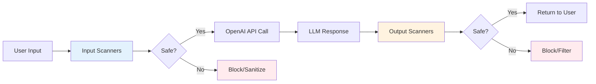

# LLM Guard Security Examples

## What is LLM Guard?

[LLM Guard](https://protectai.github.io/llm-guard/) is a **security toolkit** that acts as a protective layer for Large Language Model applications. Unlike traditional API-based security solutions, LLM Guard runs **entirely on your machine** using open-source transformer models from [Hugging Face](https://huggingface.co/), giving you complete control over your data and security policies.

### How LLM Guard Fits Into Your Workflow



## Installation

```bash
uv add llm-guard pip
```

## Two-Layer Security Architecture

LLM Guard provides **two types of scanners** that work together to secure your LLM pipeline:
- [Input scanners](https://protectai.github.io/llm-guard/input_scanners/anonymize/)
- [Output scanners](https://protectai.github.io/llm-guard/output_scanners/ban_competitors/)

### **Input Scanners**
Process and secure user prompts **before** they reach your LLM:

- **Anonymize**: Remove PII (names, emails, phone numbers) before sending to APIs
- **Prompt Injection Detection**: Block attempts to manipulate your AI system
- **Toxicity Detection**: Filter harmful or offensive content
- **Secrets Detection**: Prevent API keys and credentials from being exposed
- **Ban Competitors**: Remove mentions of competitor brands from prompts

### **Output Scanners**
Validate and filter LLM responses **after** generation:

- **Ban Competitors**: Ensure AI doesn't recommend competitor products
- **Bias Detection**: Check for unfair or discriminatory content
- **Relevance**: Verify responses stay on-topic
- **Sensitive Information**: Catch PII that might leak in responses
- **Code Validation**: Scan generated code for security issues

## Local Processing vs API-Based Solutions

| **Local (LLM Guard)** | **API-Based Solutions** |
|----------------------|-------------------------|
| ✅ **Privacy**: Data never leaves your machine | ❌ Sensitive data sent to third parties |
| ✅ **Cost**: Free after initial setup | ❌ Pay per request/scan |
| ✅ **Speed**: No network latency | ❌ Network delays for each scan |
| ✅ **Control**: Customize models and thresholds | ❌ Limited configuration options |
| ✅ **Offline**: Works without internet | ❌ Requires internet connectivity |


## How It Works Behind the Scenes

LLM Guard uses **open source transformer models** combined with regex patterns to detect and protect against security threats. Unlike OpenAI's black-box APIs, LLM Guard runs **entirely locally** using models from [Hugging Face](https://huggingface.co/):

### First-Time Setup (Model Downloads)
When you first run LLM Guard, it automatically downloads transformer models to your machine:
- **Model Size**: 200MB - 1.5GB per model (depending on configuration)
- **Storage**: Models cached in `~/.cache/huggingface/` 
- **Download Time**: 2-10 minutes (depending on internet speed)
- **One-Time Cost**: After download, everything runs offline

### Runtime Behavior
- **Subsequent Runs**: Instant startup (models cached locally)
- **Inference Speed**: 50-500ms per scan (depending on text length and model)
- **Privacy**: No data sent to external APIs - everything runs on your machine

## Model Storage & Caching

### Where Models Are Stored
Models are **NOT** stored in your virtual environment. Instead, they live in a **global cache**

### Managing Disk Usage

LLM Guard downloads models from [Hugging Face](https://huggingface.co/) and caches them locally. Use the **Hugging Face CLI** for clean model management:

**Install Hugging Face CLI:**
```bash
pip install huggingface_hub

# OR via Homebrew:
brew install huggingface-cli
```

**Check cache usage:**
```bash
huggingface-cli scan-cache
```

**Delete specific models:**
```bash
# Interactive deletion
huggingface-cli delete-cache

# Delete all cached models
huggingface-cli delete-cache --confirm
```

## Model Availability Across Scanners

Each scanner in LLM Guard can use **different models** optimized for specific tasks. The easiest way to discover available models is by exploring the **source code examples** and configuration files:

### Finding Available Models

**Method 1: Explore Code Examples**
```python
# Look for model configurations in the imports
from llm_guard.input_scanners.anonymize_helpers import (
    DEBERTA_AI4PRIVACY_v2_CONF,    # DeBERTa model for privacy
    BERT_LARGE_NER_CONF,           # BERT Large for NER
    BERT_BASE_NER_CONF,            # BERT Base (faster)
    BERT_ZH_NER_CONF               # Chinese language support
)

from llm_guard.input_scanners.prompt_injection import (
    V1_MODEL,                      # Legacy prompt injection model
    V2_MODEL,                      # Latest prompt injection model  
    V2_SMALL_MODEL                 # Smaller/faster version
)
```

**Method 2: Browse Hugging Face Models**
- **Anonymize models**: [Hugging Face AI4Privacy collection](https://huggingface.co/collections/ai4privacy)
- **Prompt injection models**: [ProtectAI on Hugging Face](https://huggingface.co/protectai)
- **Toxicity models**: [Unitary models](https://huggingface.co/unitary)

## Hybrid Detection: ML Models + Regex Patterns

LLM Guard uses a **two-layer approach** for maximum coverage:

### Layer 1: Transformer Models (Context-Aware)
- Understands context: "My name is John" vs "John Street"
- Handles variations: "J. Smith", "Smith, John", "Johnny"
- More accurate but slower

### Layer 2: Regex Patterns (Fast & Precise)
- Structured data: Credit cards, SSNs, emails
- Extremely fast pattern matching
- Catches edge cases models might miss

## Advanced Configuration Examples

### Basic Usage
```python
from llm_guard import scan_prompt
from llm_guard.input_scanners import Anonymize
from llm_guard.vault import Vault

vault = Vault()
scanner = Anonymize(vault)

prompt = "Hi, I'm John Smith. My email is john@company.com"
sanitized, is_valid, risk_score = scanner.scan(prompt)
print(sanitized)  # "Hi, I'm [REDACTED_PERSON_1]. My email is [REDACTED_EMAIL_ADDRESS_1]"
```

### Production Configuration
```python
from llm_guard.input_scanners import Anonymize
from llm_guard.input_scanners.anonymize_helpers import DEBERTA_AI4PRIVACY_v2_CONF
from llm_guard.vault import Vault

vault = Vault()
scanner = Anonymize(
    vault,
    recognizer_conf=DEBERTA_AI4PRIVACY_v2_CONF,
    preamble="[PRIVACY NOTICE] This prompt contains anonymized data.\n",
    allowed_names=["OpenAI", "Microsoft"],  # Don't anonymize these
    hidden_names=["SecretCorp"],            # Always anonymize these  
    threshold=0.8,                          # Higher threshold = less sensitive
    use_onnx=True,                          # Faster inference
    use_faker=True                          # Generate realistic fake data
)
```

## Documentation

For complete documentation and advanced configuration options, visit [LLM Guard Documentation](https://protectai.github.io/llm-guard/). 