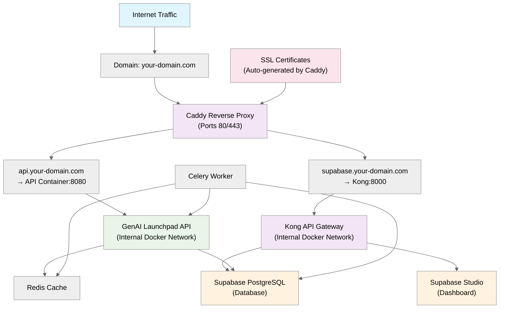

# Caddy Deployment Guide

This guide assumes you have followed the steps in [GenAI Launchpad Deployment Guide](../deployment/README.md).

## Introduction to Caddy

**Caddy** is a modern, open-source web server written in Go that automatically provides HTTPS using Let's Encrypt certificates. It's designed to be simple to use and configure, making it an excellent choice for reverse proxy setups.

## What is Kong and Its Role in Supabase

**Kong** is an open-source API gateway and microservices management layer. In the Supabase ecosystem, Kong acts as the central entry point that routes requests to various Supabase services.

### How Caddy Works as a Reverse Proxy:
```
Internet → Caddy (Port 80/443) → Internal Services (Docker Network)
```

Caddy sits between the internet and your internal services, handling:
- SSL/TLS termination
- Domain routing
- Load balancing (if needed)
- Automatic certificate management
- Request forwarding to appropriate backend services

## Architecture Overview



## Prerequisites

Before starting, ensure you have:
- A domain name (where you can manage DNS settings)
- A Hetzner server (or similar VPS) with Docker and Docker Compose installed
- SSH access to your server
- Basic understanding of DNS and Docker

## Domain Setup on GoDaddy (Example)

### Step 1: Access DNS Management
1. Log into your GoDaddy account
2. Navigate to "My Products" → "Domains"
3. Click on your domain name
4. Click "Manage DNS"

### Step 2: Create Subdomains
You need to create A records for your subdomains pointing to your server's IP address.

Create the following A records:
```
Type: A
Name: api
Value: YOUR_SERVER_IP_ADDRESS
TTL: 1 Hour (3600 seconds)

Type: A  
Name: supabase
Value: YOUR_SERVER_IP_ADDRESS
TTL: 1 Hour (3600 seconds)
```
**Note**: DNS propagation can take 24-48 hours, but usually completes within 1-2 minutes.

## Caddyfile Configuration

The Caddyfile defines how Caddy should route traffic. Here's the configuration for your Gen AI Launchpad:

### Current Caddyfile Location: `docker/Caddyfile`

Replace the contents with:

```caddy
# API Service - Gen AI Launchpad
api.your-domain.com {
    log {
        output file /var/log/caddy/api.log
        format console
        level info
    }
    reverse_proxy api:8080
}

# Supabase Service - Kong API Gateway
supabase.your-domain.com {
    log {
        output file /var/log/caddy/supabase.log  
        format console
        level info
    }
    reverse_proxy kong:8000
}
```

### Alternative: Using Environment Variables (Recommended)
For better maintainability, you can use environment variables in your Caddyfile:

```caddy
# API Service - Gen AI Launchpad
{$CADDY_DOMAIN_API} {
    log {
        output file /var/log/caddy/api.log
        format console
        level info
    }
    reverse_proxy api:8080
}

# Supabase Service - Kong API Gateway
{$CADDY_DOMAIN_SUPABASE} {
    log {
        output file /var/log/caddy/supabase.log
        format console
        level info
    }
    reverse_proxy kong:8000
}
```

Then add these environment variables to your `docker/.env` file:

```bash
CADDY_DOMAIN_API=api.your-domain.com
CADDY_DOMAIN_SUPABASE=supabase.your-domain.com
```

### Changes Required in `docker-compose.launchpad.yml`:

#### Step 1: Uncomment the Caddy Service

Find the commented Caddy section (lines 52-66) and uncomment it:

```yaml
caddy:
  container_name: "${PROJECT_NAME}_caddy"
  env_file:
    - ./.env
  image: caddy:latest
  ports:
    - "80:80"
    - "127.0.0.1:2019:2019"
    - "443:443"
  restart: always
  volumes:
    - ./Caddyfile:/etc/caddy/Caddyfile
    - /var/log/caddy:/var/log/caddy
    - caddy_config:/config
    - caddy_data:/data
```

#### Step 2: Secure the API Service

Change the API service ports from:
```yaml
ports:
  - "8080:8080"  # if you modified it
```

Back to:
```yaml
ports:
  - "127.0.0.1:8080:8080"  # Only accessible from localhost/docker network
```

## Server Deployment Steps

### Step 1: Prepare Your Server Environment

SSH into your Hetzner server:
```bash
ssh -i ~/.ssh/id_ed25519_genai_accelerator_prod root@your-server-ip
```

### Step 2: Update Your Repository
```bash
cd /opt/genai-launchpad-quickstart
git pull origin main
```

### Step 3: Update Environment Variables
Ensure your `docker/.env` file has the correct domain configurations:
```bash
# Edit your .env file to include domain-specific settings if needed
nano .env
```
### Step 4: Stop Existing Services
```bash
/stop.sh
```

### Step 5: Update Firewall Rules
Remove the old `8000` and `8080` port-specific rules and allow only HTTP/HTTPS


### Step 6: Start Services with Caddy
```bash
# Build and start all services including Caddy
./start.sh

# Check if all services are running
docker ps
```

### Step 7: Monitor Logs
```bash
# Check logs
./logs.sh
```

## Testing and Verification

Once your deployment is complete and your API is properly exposed, you need to verify that everything is working correctly.

**Access Supabase Studio:**
First, verify that Supabase is running and your database is properly set up:

1. **Open your browser** and navigate to:
   ```
   supabase.your-domain.com
   ```

2. **Authenticate with Supabase:**
   - **Username:** `supabase`
   - **Password:** `supabase`

3. **Verify the database setup:**
   Once logged in to Supabase Studio, navigate to the Tables section and confirm that the `events` table exists and is properly configured.

**Run the test script:**
After verifying Supabase is accessible, test your API endpoint by executing the `week-6/deployment/request.py` script. Make sure to update the script with your new domain: `api.your-domain.com/events`

**Monitor your deployment:**
While running the test script, monitor the logs on your server through the terminal to observe real-time activity and ensure there are no errors in the processing pipeline.

**Verify data persistence:**
Check your Supabase events table to confirm that the test events are being properly stored in your database. This final verification step ensures that your entire data pipeline is functioning correctly from API reception to database storage.